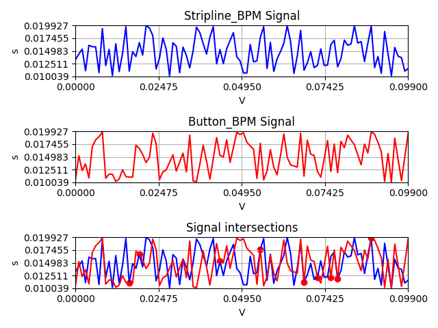

# Python-Exercises
Python project for duplicate element detection and package dependency graph reconstruction from JSON files.


## Table of Contents
- [Exercise 1](#exercise-1)
    - [Assumptions](#assumptions)
    - [Main objective](#main-objective)
    - [Usage](#usage)
        - [main.py](#mainpy)
        - [signals.py](#signalspy)
        - [Use in your code](#use-in-your-code)
    - [Requirements for class elements](#requirements-for-class-elements)
    - [Functions](#functions)
        - [Unsorted lists](#unsorted-lists)
        - [Sorted lists](#sorted-lists)
    - [Complexity](#complexity)
    - [Tests](#tests)
- [Exercise 2](#exercise-2)
    - [Function build_graph](#function-build_graph)
    - [Objective 2.2](#objective-22)
    - [Objective 2.3](#objective-23)
    - [Objective 2.4](#objective-24)

## Exercise 1
The task is to create a function that identifies all duplicate elements in a list while retaining their order. 

### Assumptions
1. **List objects** in the input list are **not necessarily of the same type**
2. **Any object is accepted** as an element for the input list. This includes lists, instances of classes, etc.
3. Boolean values **True and False** are **duplicates** of integers **1 and 0** respectively
4. The **function should accept only list types** for input. (e.g., not string input)
5. **Duplicates** are **appended only once** to the output list

### Main objective
*exercise1/detect_duplicates.py -> detect_duplicates()*
[Detect Duplicates](./exercise1/detect_duplicates.py)

### Usage

#### main.py
```
python3 exercise1/main.py
```

- The main program prompts the user to either use the default list or create a custom one
- When a valid list is specified, it is then tested for duplicates
- Decreased complexity for [sorted-lists](#sorted-lists)


#### signals.py
```
python3 exercise1/signals.py
```
Requires installation: [dependencies](#dependencies)

**A use of the detect_duplicates function**

Creates instances of signals with dummy data for
 - Beam signal
 - Button BPM signal
 - Stripline BPM signal
 - ADC signal

**Signal class**
Member Variables:
- **2D signal**
- frozenset for its units
- **duplicate_chance** can be specified (0 to 1)
**duplicates will be introduced to the signal with the corresponding probability**.

This method could be used to **test signals for anomalies** i.e., duplicates in the signal
- in the x-axis
- in the y axis
- in both of the axes


##### Dependencies
Create virtual environment: ```python -m venv signals_venv```
Activate: ```source signals_venv\bin\activate```
Install dependencies: ```python -m pip install -r requirements.txt```

##### Example use 1

Introduces duplicates to the BPM and ADC signals and **tests anomalies** by using detect_duplicates() function 

##### Example use 2

Comparing Stripline and Button BPM signals for **intersections**. Visualizing the results.



#### Use in your code:

1) Clone the repository to your projects directory

```
git clone https://github.com/Vasichar11/Exercises
```

2) Import the function and use it:

```
from Exercises.exercise1.detect_duplicates import detect_duplicates
duplicates = detect_duplicates(your_list)

```

### Requirements for class elements
- To use the duplicate function in instances of classes, the classes need to be defined with both the \_\_eq\_\_ and \_\_hash\_\_ member functions.
1) \_\_eq\_\_ method needs to be overridden to successfully compare two instances of the same class
2) \_\_hash\_\_ method will make the classes hashable, so they can be used by the detect_duplicates function

*Example class*:
```
# Test class for dates
class Date(object): 
    def __init__(self, d, m, y): 
        self.day, self.month, self.year,  = d, m, y
    
    def __eq__(self, other): # Defines how classes should be compared for equality.
        if not isinstance(other, Date): # Ensure they are both same type
            return False
        return (self.year, self.month, self.day) == (other.year, other.month, other.day)
    
    def __hash__(self):
        return hash((self.year, self.month, self.day))
    
    def display_info(self):
        return f"{self.year} {self.month} {self.day}"
```


### Functions

#### Unsorted lists
- Will detect duplicates with time complexity O(n^3)


#### Sorted lists
- Will detect duplicates with time complexity O(n)
- Keep in mind that sorting your list to use this algorithm should be avoided since the order of the elements might not be preserved.  

Elements should have all the **same type** and should be sorted in **ascending or descending** order
Sorted based on **element types**:
    1) Numeric Types (int, float, complex):  based on the magnitude of the numbers
    2) Text Type (str): based on lexicographical order
    3) Sequence Types (list, tuple, range): based on element-wise comparison. For example, two lists will be compared on their first different element 
    4) Set Type (set, frozenset): based on the occurrence of subsets or same elements
    5) Boolean Type (bool): True > False
For nested lists, dictionaries, or custom objects, Python will compare the elements based on their memory addresses and not their contents.


### Complexity
- If the input list is sorted, then a potentially faster algorithm is used that takes into account the sorted order of the elements(ascending or descending)
- The time complexity cannot be better than O(n). There's a need to examine each element at least once to determine if it's a duplicate


### Tests
PyTest is used for automated testing (test_duplicates.py)
To run all tests:
```
pytest --runxfail -v
```


## Exercise 2
 Read a JSON file containing a list of packages and their dependencies from a fixed filesystem location, and reconstruct the entire dependency graph. 

### Objective 2.2
**Reconstruct the full dependency graph**
exercise2/dependency_graph.py -> **DependencyGraph()**


### Objective 2.3
**A function that takes a filename as an input and returns an object representing the fully resolved graph**
exercise2/dependency_graph.py -> **build_graph()**


### Objective 2.4

exercise2/test_dependency_graph.py -> **\_\_main\_\_.py**

You can go to the root directory of the repo and:

```python3 -m exercise2```

### Example dependency graph for the packages
```
- pkg1
  - pkg2
    - pkg3
  - pkg3
- pkg2
  - pkg3
- pkg3

